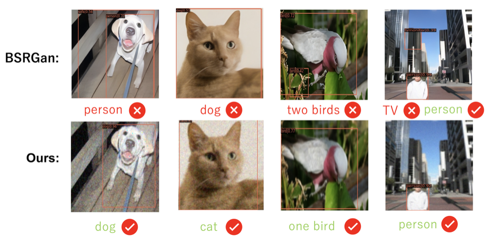
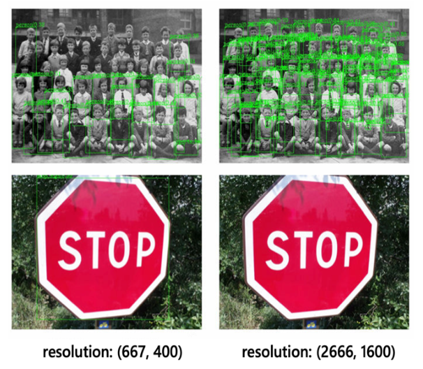
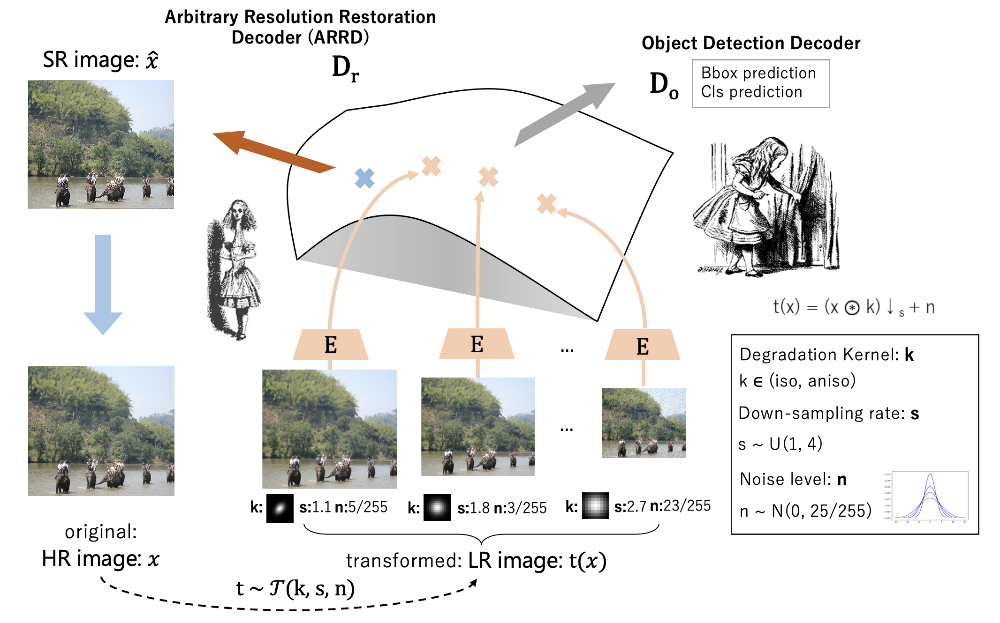

# Exploring Resolution and Degradation Clues as Self-supervised Signal for Low Quality Object Detection [[paper](https://www.ecva.net/papers/eccv_2022/papers_ECCV/papers/136690465.pdf)]


## Reference:

The work is heavily build on [mmdetection](https://github.com/open-mmlab/mmdetection) and [kornia](https://openaccess.thecvf.com/content_WACV_2020/html/Riba_Kornia_an_Open_Source_Differentiable_Computer_Vision_Library_for_PyTorch_WACV_2020_paper.html), thanks for their great project!

If you use this work in your research, please consider to cite:

```
@inproceedings{cui2022exploring,
  title={Exploring Resolution and Degradation Clues as Self-supervised Signal for Low Quality Object Detection},
  author={Cui, Ziteng and Zhu, Yingying and Gu, Lin and Qi, Guo-Jun and Li, Xiaoxiao and Zhang, Renrui and Zhang, Zenghui and Harada, Tatsuya},
  booktitle={European Conference on Computer Vision},
  pages={473--491},
  year={2022},
  organization={Springer}
}

```


## Abstract:
Image restoration algorithms such as super resolution (SR) are indispensable pre-processing modules for object detection in low quality images. Most of these algorithms assume the degradation is fixed and known a priori. However, in practical, either the real degradation or optimal up-sampling ratio rate is unknown or differs from assumption, leading to a deteriorating performance for both the pre-processing module and the consequent high-level task such as object detection. Here, we propose a novel self-supervised framework to detect objects in degraded low resolution images. We utilizes the downsampling degradation as a kind of transformation for self-supervised signals to explore the equivariant representation against various resolutions and other degradation conditions. The Auto Encoding Resolution in Self-supervision (AERIS) framework could further take the advantage of advanced SR architec- tures with an arbitrary resolution restoring decoder to reconstruct the original correspondence from the degraded input image. Both the rep- resentation learning and object detection are optimized jointly in an end-to-end training fashion. The generic AERIS framework could be implemented on various mainstream object detection architectures with different backbones. The extensive experiments show that our methods has achieved superior performance compared with existing methods when facing variant degradation situations.


<div align="center">
  
</div>
<p align="center">
  Fig 1. The gap between recognition methods and restoration methods. Top line detection results build on the SOTA restoration methods BSRGAN, second line is the AERIS detection result.
</p>


<div align="center">
  
</div>
<p align="center">
  Fig 2. The scale gap in object detection task. Larger image size is friendly to small object detection, smaller image size is friendly to large object detection.
</p>


<div align="center">
  
</div>
<p align="center">
  Fig 3. We use AERIS to find the scale-invariant feature for object detection under low resolution.
</p>

## Environment:
The code is base on mmdet 2.23.0, to use this code please following the steps build enviroment:

```
conda create -n AERIS python==3.7.0

conda activate AERIS

conda install --yes -c pytorch pytorch=1.7.0 torchvision cudatoolkit=11.0 (for other version, please follow [pytorch](https://pytorch.org/))

pip install mmcv-full==1.5.0 -f https://download.openmmlab.com/mmcv/dist/cu110/torch1.7.0/index.html (download mmcv with your cuda and torch version)

pip install -r requirements.txt

pip install -v -e .
```


## Dataset:

**COCO-d dataset:** Translate COCO-val2017 with random noise/ blur/ down-sampling(1~4) resolution, details please refer to our paper.

1. Download the [COCO](https://cocodataset.org/#home) dataset's [train2017](http://images.cocodataset.org/zips/train2017.zip), [val2017](http://images.cocodataset.org/zips/val2017.zip) and [train_val_label](http://images.cocodataset.org/annotations/annotations_trainval2017.zip).

2. Download the **COCO-d** dataset. Dataset link: [(g-drive)](https://drive.google.com/file/d/1mXh_6KZm1ujgc1UOsOPXtPV4dKS_hx9F/view?usp=sharing) or [(baiduyun, passwd:p604)](https://pan.baidu.com/s/1HBo74HpRqIOT0m4_tzKlTg). Label link: [g-drive](https://drive.google.com/file/d/1blrN-QpGmSVyu26Ts5xnDmsAQBcuDtiO/view?usp=sharing) or [(baiduyun, passwd:iosl)](https://pan.baidu.com/s/1VmEnDr8MRiAx_Pca5GkIow).

3. Place the **COCO-d** dataset into original COCO dataset, the format should like:


```
${COCO}
|-- annotations
    |-- instances_train2017.json
    |-- instances_val2017.json
    |-- instances_val2017_down1_4.json (COCO-d label)
|-- train2017
|-- val2017
|-- val2017_down1_4 (COCO-d image)
```


**Specific Degradation Setting:** 
TBD

**Generate Degradation Dataset by Your Own**: 
TBD

## Model inference:

| Model | Config | Download Link | AP | AP small | AP medium | AP large |
|  ---- | ---- | ---- | ---- |  ---- | ---- | ---- | 
| CenterNet-Res18 | [config](configs/centernet_AERIS/centernet_res18.py) | [g-drive](https://drive.google.com/file/d/1PH4eU1LQzjxCg9ei2YyVmVudLrSWbyB3/view?usp=sharing) | 14.5 | 1.2 | 10.4 | 38.6 | 
| CenterNet-Res18-AERIS (w/o ARRD) | [config](configs/centernet_AERIS/centernet_res18.py) | [g-drive](https://drive.google.com/file/d/1IiQJPOIzQrzIv1VYyecwrWXXz5jjF-4r/view?usp=sharing) | 17.6 | 2.5 | 15.9 | 41.4 | 
| CenterNet-Res18-AERIS (Stage1) | [config](configs/centernet_AERIS/centernet_res18_stage1.py) | [g-drive](https://drive.google.com/file/d/1hshZT5cRLLl0SVeRgmGCao9r1a0VPXMW/view?usp=sharing) | 18.2 | 2.6 | 16.2 | 43.2 | 
| CenterNet-Res18-AERIS (Stage2) | [config](configs/centernet_AERIS/centernet_res18_stage2.py) | [g-drive](https://drive.google.com/file/d/1BOUMTfTcCXLVMEHciA7n_ElLBBHx84os/view?usp=sharing) | 18.4 | 2.7 | 16.4  | 46.5 | 
| CenterNet-SwinTiny | [config](configs/centernet_AERIS/centernet_swint.py) | [g-drive](https://drive.google.com/file/d/1TT6Pw0GOECebW__qjUX-KB9_4EHtfB55/view?usp=sharing) | 19.9 | 2.7 | 16.9 | 46.2 | 
| CenterNet-SwinTiny-AERIS (Stage2) | [config](configs/centernet_AERIS/centernet_swint_stage2.py) | [g-drive](https://drive.google.com/file/d/1QqVXQm0E0GFNX6UCTqe03SWJL87RCp04/view?usp=sharing) | 21.6 | 3.2 | 20.4 | 49.0 | 

***Config File:***

**centernet_res18.py**: config of baseline CenterNet-ResNet model.

**centernet_res18_woARRD.py**: config of baseline CenterNet-ResNet-AERIS without the ARRD decoder.

**centernet_res18_stage1.py**: config of CenterNet-ResNet-AERIS with the ARRD decoder on stage 1.

**centernet_res18_stage2.py**: config of CenterNet-ResNet-AERIS with the ARRD decoder on stage 2.

**centernet_swint.py**: config of baseline CenterNet-Swin model.

**centernet_swint_stage2.py**: config of CenterNet-Swin-AERIS with the ARRD decoder on stage 2.

For the model testing, please use the following code. We show the CenterNet-Res18-AERIS (Stage2) testing for example:

```
python tools/test.py configs/centernet_AERIS/centernet_up_stage2.py "model_ckpt_path" --eval bbox
```

## Model Training:

We trained our AERIS on 4 GPUs (with the initial learning rate 0.01), if you want use other GPU number, please change the learning rate. 

We show the CenterNet-Res18-AERIS (Stage2) training for example:

```
CUDA_VISIBLE_DEVICES=0,1,2,3 PORT=29500 bash tools/dist_train.sh configs/centernet_AERIS/centernet_up_stage2.py 4
```


